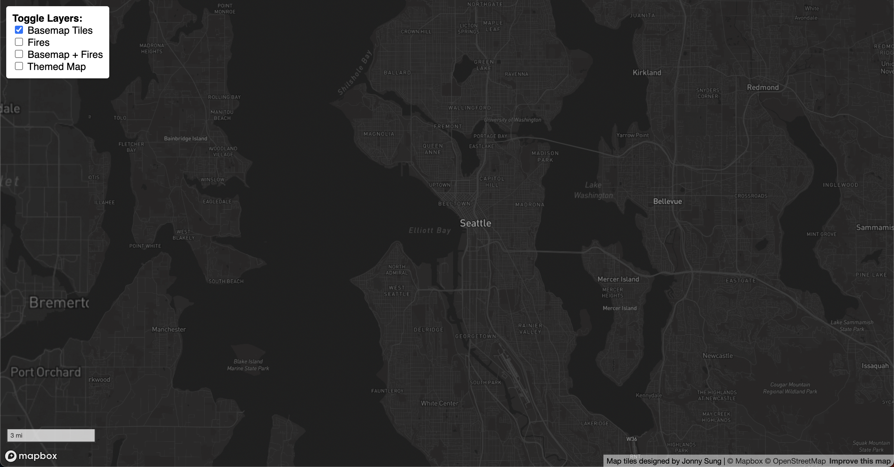
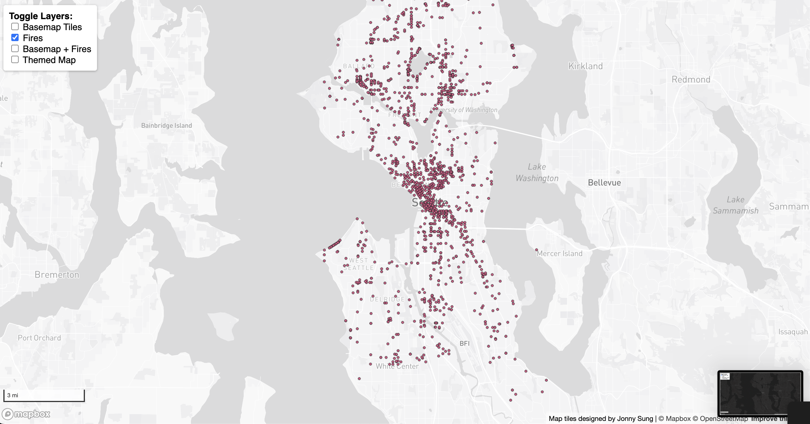
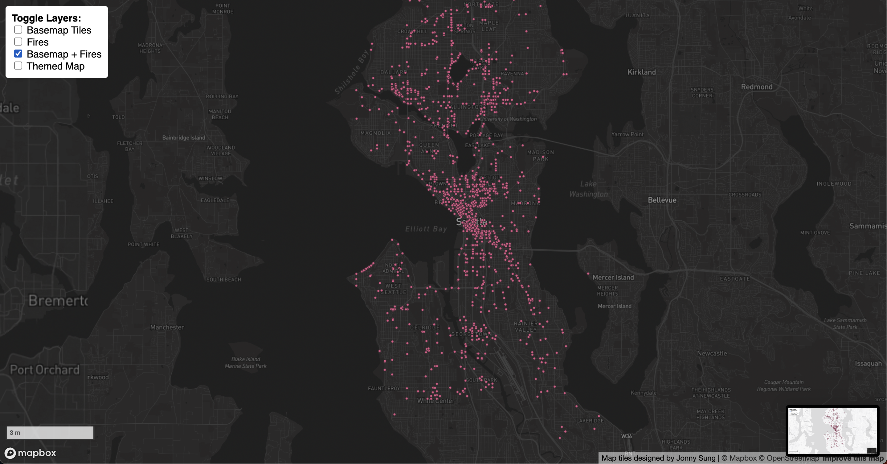
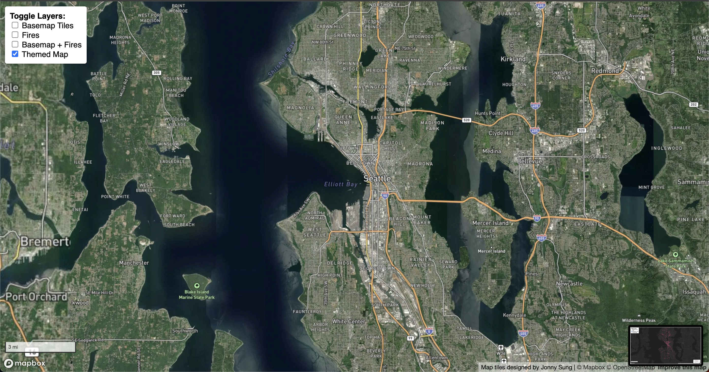

# Seattle Fires Map Tiles

## Web Map URL
You can view the interactive map here:  
https://[your_github_username].github.io/[your_repository_name]  

## Screenshots of Tile Layers
| Layer | Screenshot |
|-------|------------|
| Tileset 1: Basemap |  |
| Tileset 2: Fires |  |
| Tileset 3: Basemap + Fires |  |
| Tileset 4: Satellite / Environmental Context |  |

## Examined Geographic Area
The map focuses on the city of **Seattle, Washington, USA**, including surrounding parks, forests, and urban neighborhoods. The extent roughly covers latitude 47.45°N to 47.75°N and longitude -122.45°W to -122.25°W.  

## Zoom Levels
| Tileset | Zoom Levels |
|---------|-------------|
| Tileset 1: Basemap | 11 – 15 |
| Tileset 2: Fires | 11 – 15 |
| Tileset 3: Basemap + Fires | 11 – 15 |
| Tileset 4: Satellite / Environmental Context | 11 – 15 |

## Tile Set Descriptions
1. **Tileset 1 – Basemap**: A monochrome basemap of Seattle showing streets, water, and land areas. This serves as a neutral background for overlaying other layers.  
2. **Tileset 2 – Fires**: Raster tiles displaying the locations of historical fires in Seattle as point features. Provides a clear visual of fire distribution.  
3. **Tileset 3 – Basemap + Fires**: Combines Tileset 1 and 2 into a single tile layer to show fire locations within the context of the city’s geography.  
4. **Tileset 4 – Satellite / Environmental Context**: A satellite-style basemap showing natural and urban environments. Useful for assessing fire locations relative to parks, forests, and other land cover.  
